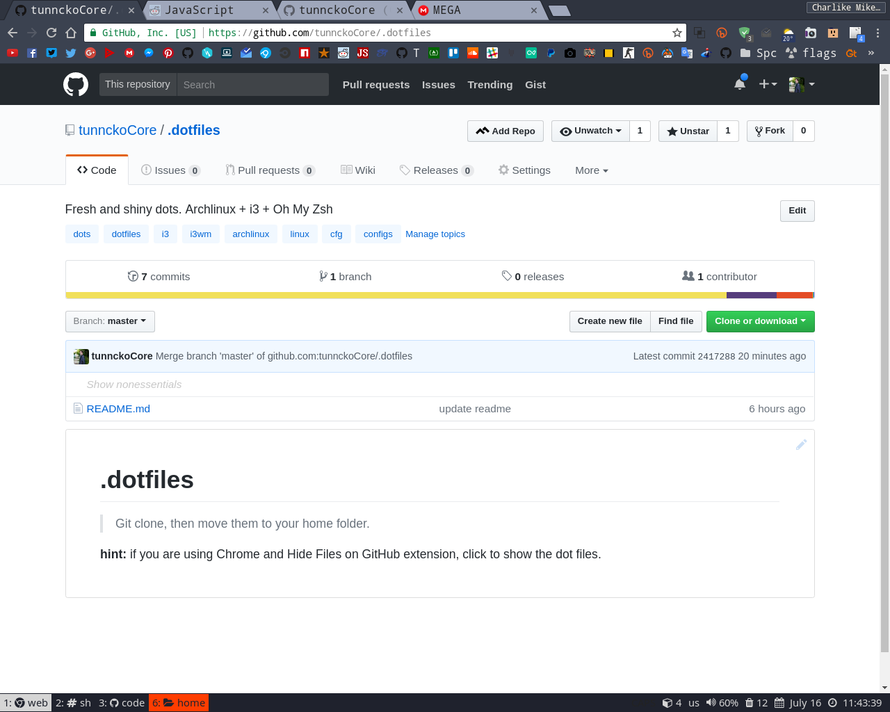
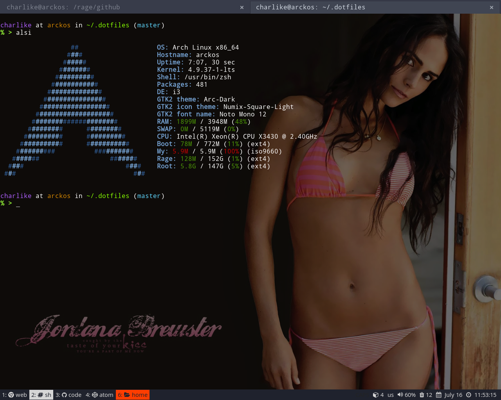
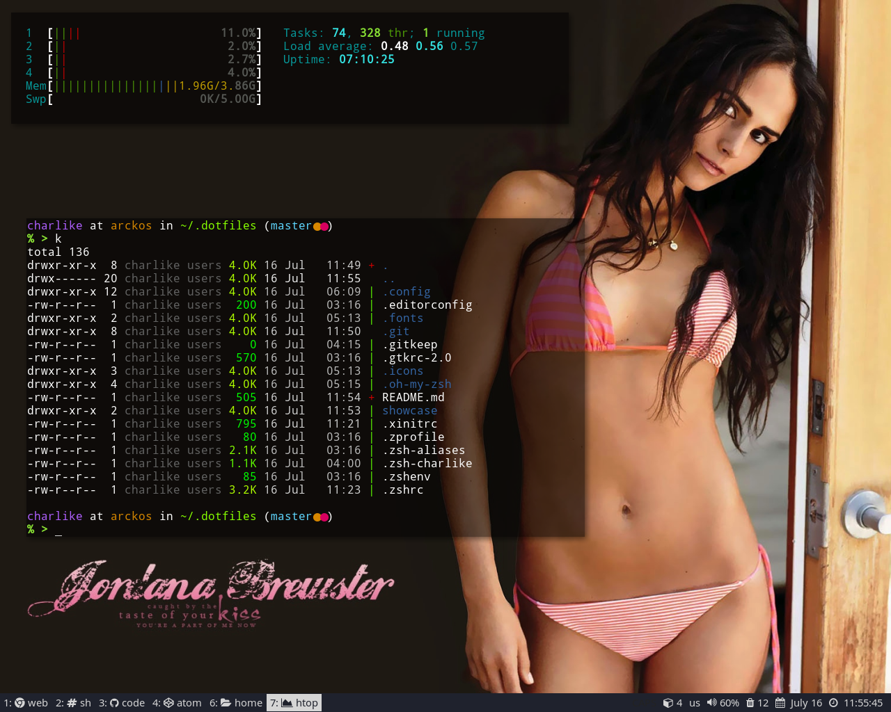
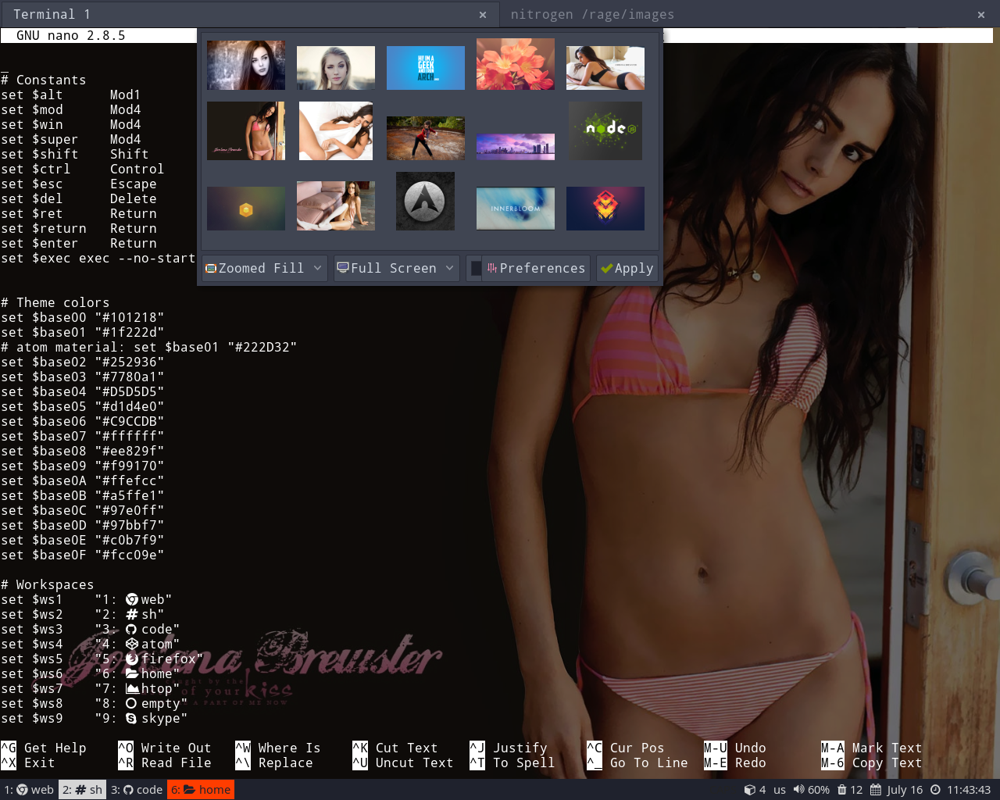

# .dotfiles

> Git clone, then move them to your home folder.

**hint:** if you are using Chrome and _"Hide Files on GitHub"_ extension, click _"Show nonessentials"_ to show the dot files.

### Repo preview

### terminal and alsi

### htop, k

### xfce4-terminal, nitrogen, i3 config

### Clean
